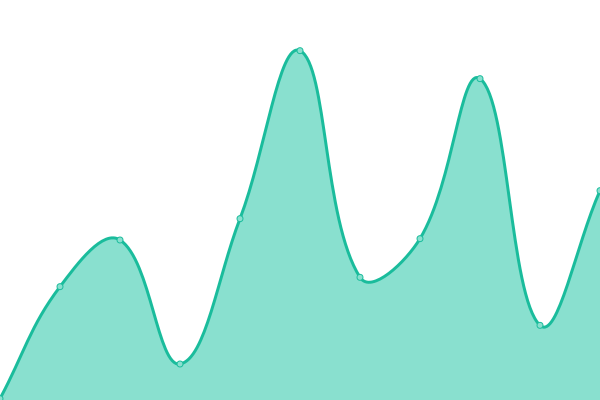

# [📈 Live Status](https://bacteriadb.com): <!--live status--> **🟧 Partial outage**

This repository contains the open-source uptime monitor and status page for [Suliman Sharif](https://www.sulstice.dev/), powered by [Upptime](https://github.com/upptime/upptime).

With [Upptime](https://upptime.js.org), you can get your own unlimited and free uptime monitor and status page, powered entirely by a GitHub repository. We use [Issues](https://github.com/Sulstice/Uptime-Bacteria/issues) as incident reports, [Actions](https://github.com/Sulstice/Uptime-Bacteria/actions) as uptime monitors, and [Pages](https://bacteriadb.com) for the status page.

<!--start: status pages-->
<!-- This summary is generated by Upptime (https://github.com/upptime/upptime) -->
<!-- Do not edit this manually, your changes will be overwritten -->
<!-- prettier-ignore -->
| URL | Status | History | Response Time | Uptime |
| --- | ------ | ------- | ------------- | ------ |
|  [Blimbing Portofolio](https://blimbing.xyz) | 🟥 Down | [blimbing-portofolio.yml](https://github.com/FahmiBahtiar/status-server/commits/HEAD/history/blimbing-portofolio.yml) | 

 1598ms
     
 | 

<a href="https://status.blimbing.xyz/history/blimbing-portofolio">29.52%</a>
    

|  [Code Market](https://codemarket.blimbing.xyz) | 🟩 Up | [code-market.yml](https://github.com/FahmiBahtiar/status-server/commits/HEAD/history/code-market.yml) | 

 513ms
     
 | 

<a href="https://status.blimbing.xyz/history/code-market">30.18%</a>
    

|  [Blog Blimbing](https://blog.blimbing.xyz) | 🟩 Up | [blog-blimbing.yml](https://github.com/FahmiBahtiar/status-server/commits/HEAD/history/blog-blimbing.yml) | 

 845ms
     
 | 

<a href="https://status.blimbing.xyz/history/blog-blimbing">30.50%</a>
    

|  [Code Market API](https://codemarket.blimbing.xyz/api/v1/products) | 🟥 Down | [code-market-api.yml](https://github.com/FahmiBahtiar/status-server/commits/HEAD/history/code-market-api.yml) | 

 61ms
     
 | 

<a href="https://status.blimbing.xyz/history/code-market-api">0.00%</a>
    

|  [Links Bio Profile](https://me.blimbing.xyz) | 🟩 Up | [links-bio-profile.yml](https://github.com/FahmiBahtiar/status-server/commits/HEAD/history/links-bio-profile.yml) | 

 183ms
     
 | 

<a href="https://status.blimbing.xyz/history/links-bio-profile">30.85%</a>
    

<!--end: status pages-->

[**Visit our status website →**](https://bacteriadb.com)

## 📄 License

- Powered by: [Upptime](https://github.com/upptime/upptime)
- Code: [MIT](./LICENSE) © [Suliman Sharif](https://www.sulstice.dev/)
- Data in the `./history` directory: [Open Database License](https://opendatacommons.org/licenses/odbl/1-0/)
